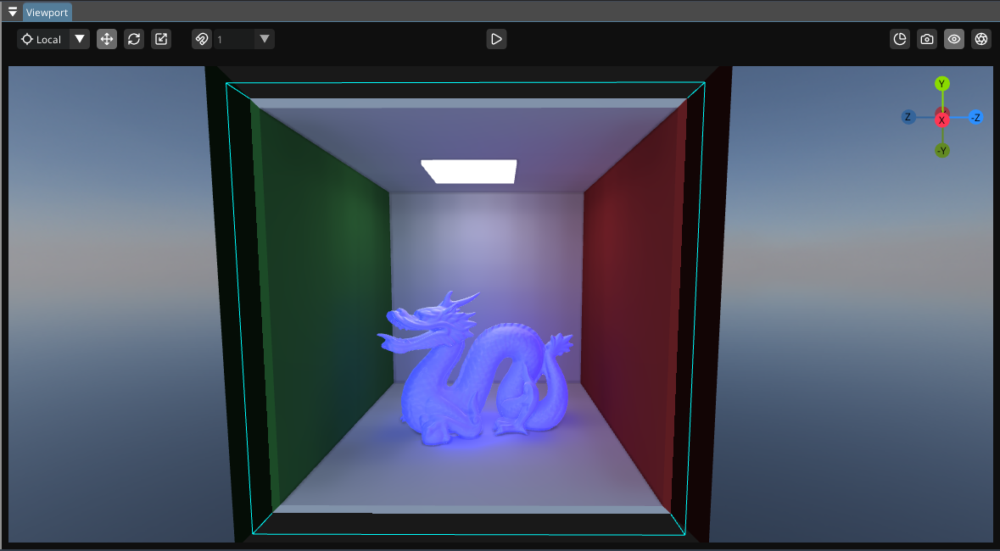

<h1 align="center">Shard Engine</h1>

<p align="center">
  <picture>
    <source media="(prefers-color-scheme: dark)" srcset=".github/ShardLogoWhite.png" width="15%">
    <source media="(prefers-color-scheme: light)" srcset=".github/ShardLogoBlack.png" width="15%">
    
  </picture>
</p>

<p align="center">
  Yet another game engine<br>
</p>

## Screenshots

<div align="center">
  
  <p><i>Path traced render</i></p>
  
  <p><i>View in engine</i></p>
  
  <p><i>Real-time baked ddgi (~0.34ms)</i></p>
</div>

## How to use (Linux)

// WIP

## How to use (Windows)

### Build tools :
- CMake 3.28.2 or later
- C++ 17 Compiler (GCC MinGW recommended)

### Proprietary Dependencies :
- FMOD Core API 2.03.14

### Editor Fonts : (Place both in editor_resources/fonts/)
- [OpenSans-Regular.ttf](https://github.com/googlefonts/opensans)
- [lucide.ttf](https://unpkg.com/lucide-static@latest/font/lucide.ttf)


### How to build & run :

Modify imgui submodule to use our vulkan.h (src/engine/rendering/backends/glad/include/glad/vulkan.h)

Place the fonts (.ttf) inside their folder (editor_resources/fonts/)

Run build.bat or build.sh (depending on your OS)

This will compile everything from root : submodules, the engine, the editor, and the game module (loaded with the game app)

Drop fmod.dll and glfw3.dll inside the build folder

Drop engine_resources folder and editor_resources folder inside build directory

Drop ShardReflect executable inside build/tools/

This runs the editor, loads the game module, opens the project at "project path" and uses open gl core as the rendering api
```bash
./ShardEditor.exe --game libGameModule.dll --project ..\\test_project\\test_project.json --api opengl
```

## Credits/Dependencies

- Libraries/Projects :
  - [GLFW](https://github.com/glfw/glfw)
  - [GLM](https://github.com/g-truc/glm)
  - [Jolt](https://github.com/jrouwe/JoltPhysics)
  - [IconFontCppHeaders](https://github.com/juliettef/IconFontCppHeaders)
  - [ImGui](https://github.com/ocornut/imgui)
  - [ImGuizmo](https://github.com/CedricGuillemet/ImGuizmo)
  - [freetype](https://github.com/freetype/freetype)
  - [glad](https://github.com/Dav1dde/glad)
  - [ufbx](https://github.com/ufbx/ufbx)
  - [json for c++](https://github.com/nlohmann/json)
  - [fmod](https://www.fmod.com/)
  - [ImOGuizmo](https://github.com/fknfilewalker/imoguizmo)
  - [ImGuiNotify](https://github.com/TyomaVader/ImGuiNotify/tree/Dev)

- Fonts :
  - [Lucide icons](https://lucide.dev/)
  - [Open Sans](https://fonts.google.com/specimen/Open+Sans)

- Sounds/Music :
  - [TownTheme.mp3](https://opengameart.org/content/town-theme-rpg)

- Models :
  - "Rubik's Cube" (<https://skfb.ly/6U7pp>) by RED2000 is licensed under Creative Commons Attribution (<http://creativecommons.org/licenses/by/4.0/>).
  - Intel Sponza 2022 Scene commissioned by Frank Meinl, sponsored by Anton Kaplanyan [Link](https://www.intel.com/content/www/us/en/developer/topic-technology/graphics-processing-research/samples.html)
  - "Cerberus" Gun model [Andrew Maximov](https://artisaverb.info/PBT.html) 
  - "Stanford Dragon (Vrip)" (<https://skfb.ly/BSZn>) by 3D graphics 101 is licensed under Creative Commons Attribution-NonCommercial (<http://creativecommons.org/licenses/by-nc/4.0/>).

- Textures :
  - [Qwantani Afternoon (Pure Sky)](https://polyhaven.com/a/qwantani_afternoon_puresky)
