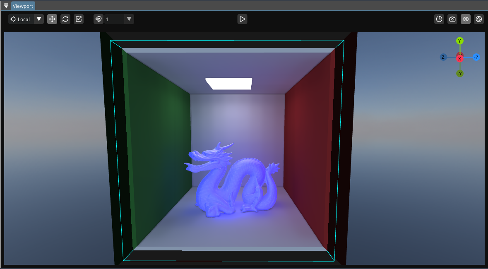

<h1 align="center">Shard Engine</h1>

<p align="center">
  <picture>
    <source media="(prefers-color-scheme: dark)" srcset=".github/ShardLogoWhite.png" width="15%">
    <source media="(prefers-color-scheme: light)" srcset=".github/ShardLogoBlack.png" width="15%">
    
  </picture>
</p>

<p align="center">
  A modular, data-oriented game engine built to be bent, not worked around<br>
</p>

## Screenshots

<div align="center">
  
  <p><i>Path traced render</i></p>
  
  <p><i>View in engine</i></p>
  
</div>

## How to use (Linux)

// WIP

## How to use (Windows)

### Build tools :
- CMake 3.28.2 or later
- C++ 17 Compiler (GCC MinGW recommended)

### Editor Fonts : (Place both in resources/editor_resources/fonts/)
- [OpenSans-Regular.ttf](https://github.com/googlefonts/opensans)
- [lucide.ttf](https://unpkg.com/lucide-static@latest/font/lucide.ttf)


### How to build & run :

Modify imgui submodule to use our vulkan.h (src/engine/renderer/rhi/backends/glad/include/glad/vulkan.h)

Place the fonts (.ttf) inside their folder (resources/editor_resources/fonts/)

Run build.bat or build.sh (depending on your OS)

This will compile everything from root : submodules, the engine, the editor, and the game module (loaded with the game app)

SDL3.dll is built with the project and lands in the build folder.

On Linux, SDL3 is built from source and needs the development packages of your window system (X11 / Wayland, ALSA / PulseAudio, libudev ...) : see https://wiki.libsdl.org/SDL3/README-linux

Copy the resources/engine_resources and resources/editor_resources folders inside the build directory

ShardReflect (the reflection generator, in src/apps/tools/reflect) is built with the project into build/tools/ when LLVM, Clang and zlib are found (otherwise it is skipped : the generated *.reflection.hpp files are committed). See src/apps/tools/reflect/README.md

This runs the editor, loads the game module, opens the project at "project path" and uses open gl core as the rendering api
```bash
./ShardEditor.exe --game libGameModule.dll --project ..\\example_project\\example_project.json --api opengl
```

## Credits/Dependencies

- Libraries/Projects :
  - [SDL3](https://github.com/libsdl-org/SDL)
  - [GLM](https://github.com/g-truc/glm)
  - [Jolt](https://github.com/jrouwe/JoltPhysics)
  - [IconFontCppHeaders](https://github.com/juliettef/IconFontCppHeaders)
  - [ImGui](https://github.com/ocornut/imgui)
  - [ImGuizmo](https://github.com/CedricGuillemet/ImGuizmo)
  - [freetype](https://github.com/freetype/freetype)
  - [glad](https://github.com/Dav1dde/glad)
  - [ufbx](https://github.com/ufbx/ufbx)
  - [json for c++](https://github.com/nlohmann/json)
  - [miniaudio](https://github.com/mackron/miniaudio)
  - [ImOGuizmo](https://github.com/fknfilewalker/imoguizmo)
  - [ImGuiNotify](https://github.com/TyomaVader/ImGuiNotify/tree/Dev)

- Fonts :
  - [Lucide icons](https://lucide.dev/)
  - [Open Sans](https://fonts.google.com/specimen/Open+Sans)

- Sounds/Music :
  - [TownTheme.mp3](https://opengameart.org/content/town-theme-rpg)

- Models :
  - "Rubik's Cube" (<https://skfb.ly/6U7pp>) by RED2000 is licensed under Creative Commons Attribution (<http://creativecommons.org/licenses/by/4.0/>).
  - Intel Sponza 2022 Scene commissioned by Frank Meinl, sponsored by Anton Kaplanyan [Link](https://www.intel.com/content/www/us/en/developer/topic-technology/graphics-processing-research/samples.html)
  - "Cerberus" Gun model [Andrew Maximov](https://artisaverb.info/PBT.html) 
  - "Stanford Dragon (Vrip)" (<https://skfb.ly/BSZn>) by 3D graphics 101 is licensed under Creative Commons Attribution-NonCommercial (<http://creativecommons.org/licenses/by-nc/4.0/>).

- Textures :
  - [Qwantani Afternoon (Pure Sky)](https://polyhaven.com/a/qwantani_afternoon_puresky)

## Philosophy

The engine is a small, strict core meant to be extended. The engine, genre modules (voxel, space, racing...) and game all plug in through the **same public API**. Keep the pieces independent so any of them can be replaced without touching the rest.

> This is the target architecture. The renderer currently uses OpenGL ; Vulkan is the planned primary backend.

## Guidelines

1. **Dependencies point down** : a layer only depends on the layers below it.
2. **Peers are decoupled** : Renderer, Physics, Audio, Input never include each other (use ECS components, events or lower-level interfaces).
3. **Everything is a module** : engine, genres and game share one registration API.
4. **Simulation ≠ rendering** : the renderer only consumes an immutable snapshot extracted from the ECS.
5. **Data-oriented + jobs** : archetype ECS, systems with declared read/write access, no ad-hoc threads.
6. **Reflection everywhere** : ShardReflect drives serialization, inspector, replication, undo.
7. **Backends behind interfaces** : RHI, Jolt, miniaudio and SDL3 are replaceable.
8. **Large world by default** : 64-bit coordinates, reference frames, gravity as world data.
9. **Optional determinism** : fixed timestep, seeded RNG, stable system order.
10. **Headless & multi-view** : runs without window/GPU/audio ; N views per frame.