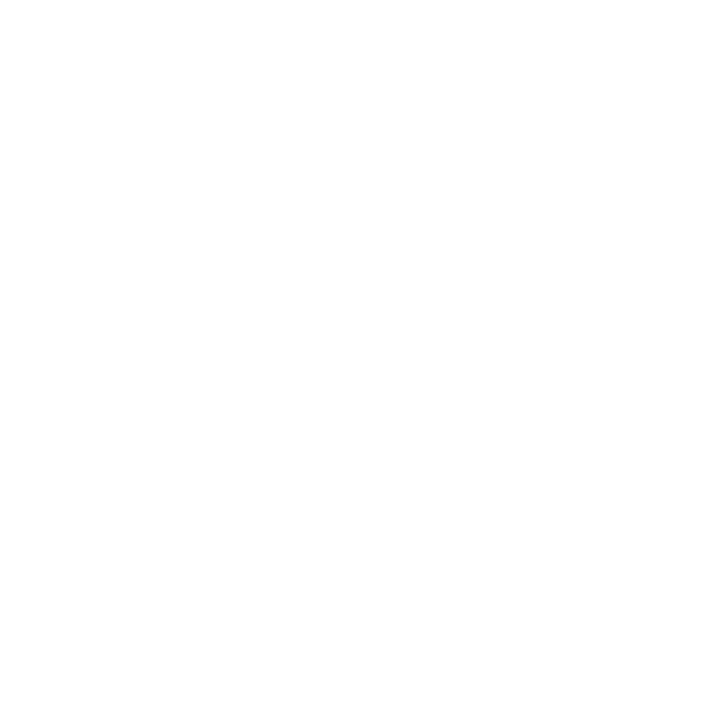

# Welcome

<p align="center">
  
</p>

<script>
  function updateLogo() {
    const scheme = document.body.getAttribute('data-md-color-scheme');
    const logo = document.getElementById('shard-logo');
    if (!logo) return;

    logo.src = scheme === 'slate'
      ? '../images/ShardLogoBlack.png'
      : '../images/ShardLogoWhite.png';
  }

  // Initial update on page load
  window.addEventListener("load", updateLogo);

  // Update on theme change
  new MutationObserver(updateLogo).observe(document.body, {
    attributes: true,
    attributeFilter: ['data-md-color-scheme']
  });
</script>

Welcome to the official documentation for **Shard Engine**, a modular, modern **3D game engine** built to give developers full control over their game/interactive experience.

Whether you're building a fast-paced action game, a simulation or a multiplayer-voxel-space exploration-roguelike-open-world game, Shard gives you the tools and the architecture to make it happen.

---

## What is Shard Engine?

**Shard Engine** is a modular, cross-platform (desktop only: Windows and Linux) 3D game engine written in C++17, focused on:

- 🧩 **Modularity**: use only what you need: rendering, physics, audio, input and more.
- 🖥️ **High performance**: designed for demanding real-time applications.
- 🔧 **Customizability**: open-source, extensible, and built for developers who want full control.

!!! warning "Alpha release notice"
    **Shard Engine** is in **active development**. An alpha version is expected in **November 2026**. Contributions, feedback and testing are welcome.

---

## ✨ Features

| Area                       | Highlights                                                                                                            |
|----------------------------|-----------------------------------------------------------------------------------------------------------------------|
| **Rendering**              | OpenGL core backend, PBR materials, dynamic lights, probe-based global illumination, path-traced reference renders    |
| **Physics**                | Rigid bodies and collisions powered by [Jolt](https://github.com/jrouwe/JoltPhysics)                                  |
| **Audio**                  | 3D positional audio through [FMOD](https://www.fmod.com/)                                                             |
| **Input**                  | Keyboard, mouse and gamepads (with dead zones and rumble)                                                             |
| **Assets**                 | FBX import ([ufbx](https://github.com/ufbx/ufbx)), reflection-based JSON serialization                                |
| **Platform**               | A dedicated [Platform Abstraction Layer](../platform.md): windowing, filesystem, threads, networking, crash reporting |
| **Editor**                 | An ImGui editor with scene hierarchy, gizmos and thumbnails, plus a hot-loadable game module                          |

## 🚀 Quick start

**Requirements:** CMake 3.28.2+, a C++17 compiler (GCC MinGW recommended on Windows) and the FMOD Core API 2.03.14.

```bash
# Build everything: submodules, engine, editor and game module
./build.sh        # or build.bat on Windows

# Run the editor with the example project
./ShardEditor.exe --game libGameModule.dll --project ../example_project/example_project.json --api opengl
```

The full setup (fonts, FMOD, resource folders, Linux packages) is described in [Getting Started](getting-started.md).

---

## 📚 Documentation overview

- [Getting Started](getting-started.md): Install the engine and build your first game.
- [Core Concepts](../core-concepts.md): objects, scene management, inputs, rendering and more.
- [Modules](../modules.md): How rendering, audio, physics and scripting work.
- [Platform Abstraction Layer](../platform.md): OS and window system abstractions, gamepads, Linux build notes.
- [API Reference](../API-reference.md): Detailed documentation of public classes and methods.
- [Tutorials](../tutorials.md): Step-by-step guides for common gameplay mechanics.
- [Contributing](../contributing.md): How to contribute to the engine itself.

---

## 🧭 Navigation tips

Use the navigation bar to jump between topics and the search bar at the top to find anything quickly.

Need help or found a bug? Open an issue on [GitHub](https://github.com/Windokk/Shard/issues).

---

*Shard Engine is an open-source project licensed under GNU GPL v3.0.*
